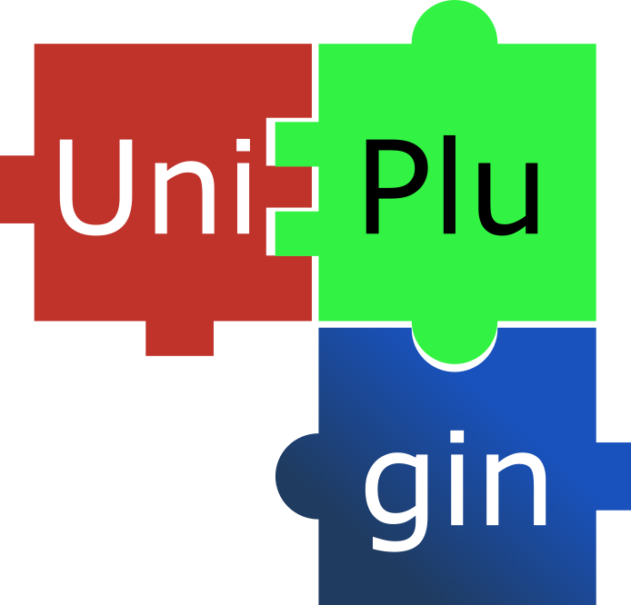

# UniPlugin: Plugins, unified.
[Documentation](https://athar-adv.github.io/UniPlugin)

`UniPlugin` is a Plugin wrapper that provides simple inter-plugin import/export semantics for public plugin apis.
